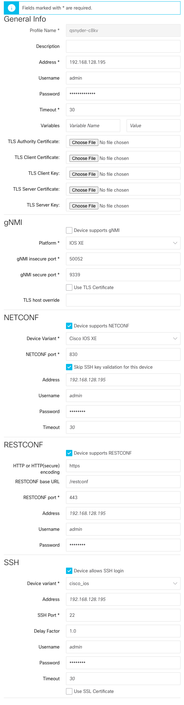
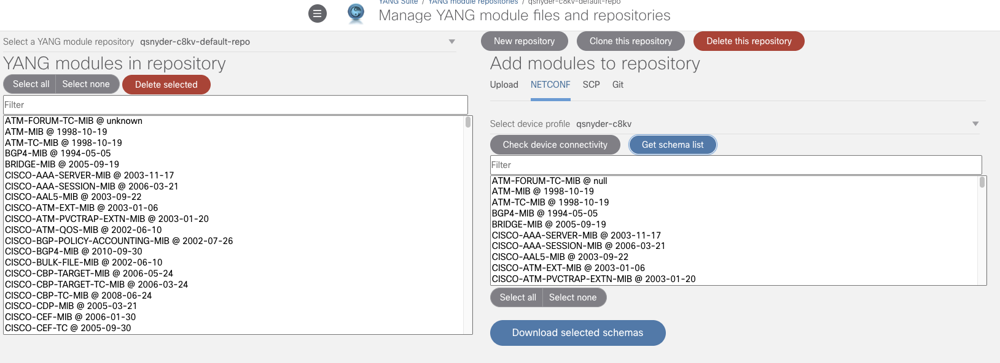
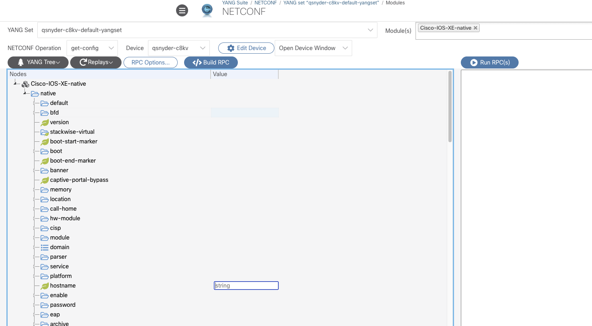
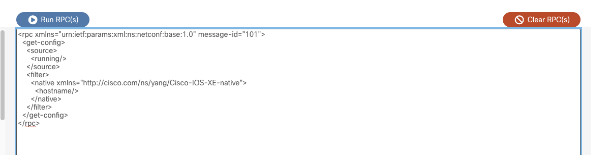
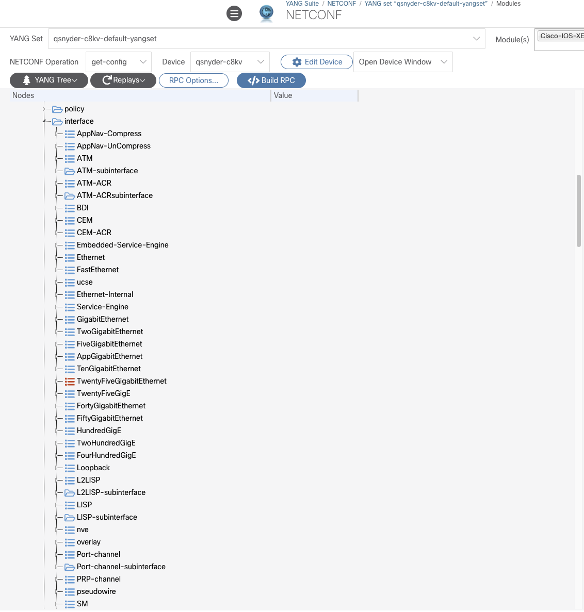
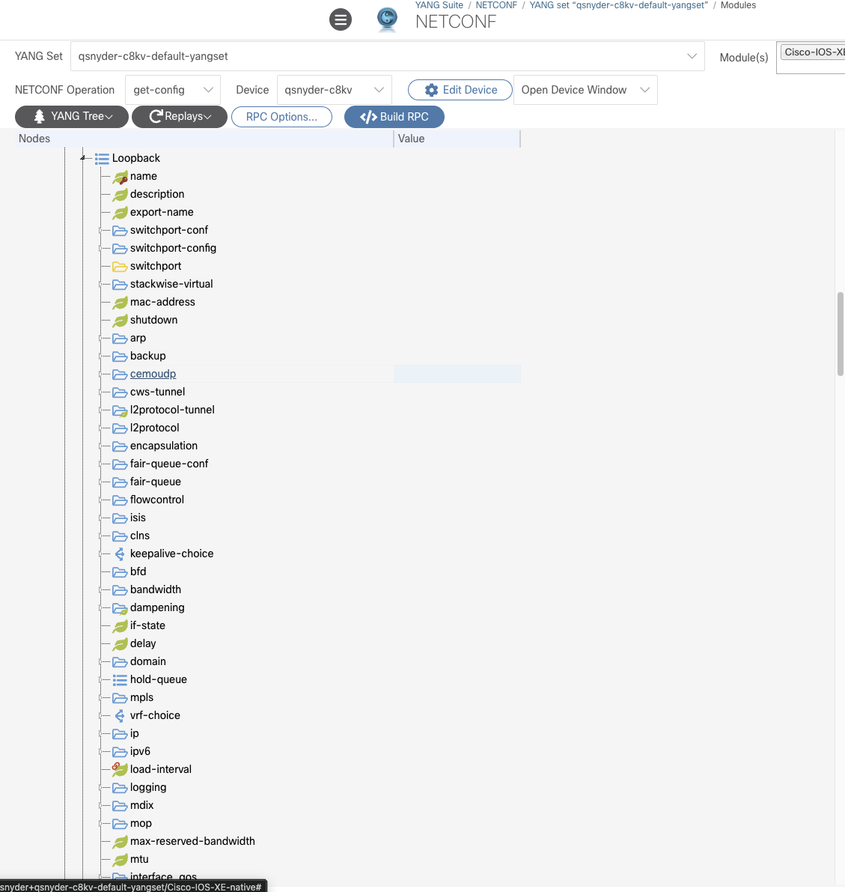
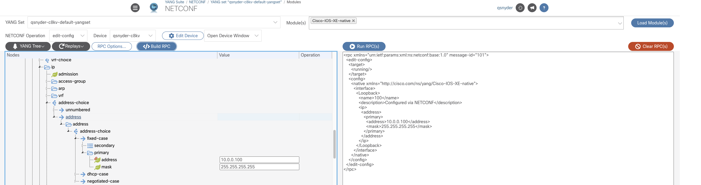
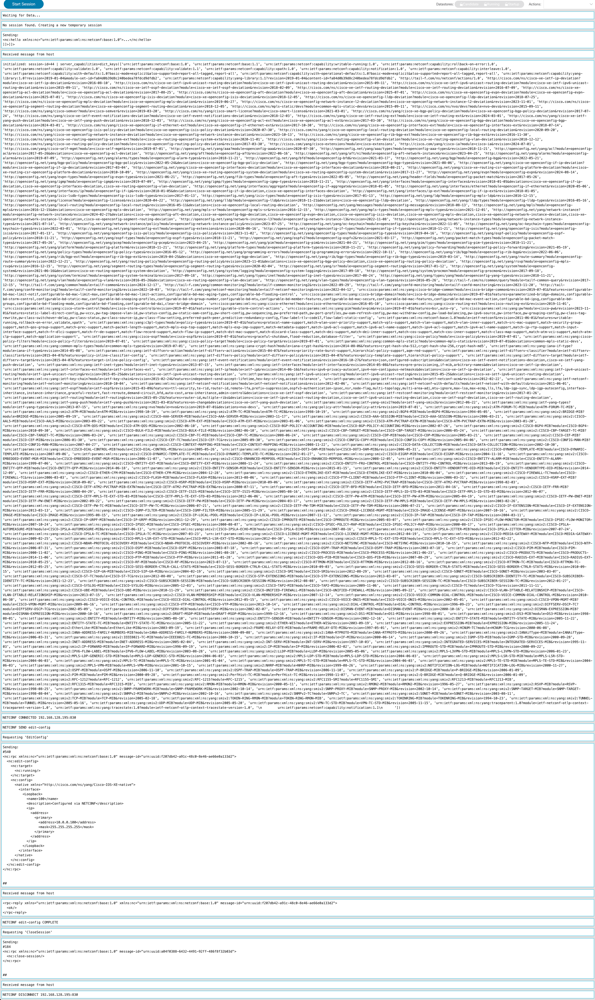

# CCNA Automation Prep — Season 1, Episode 5: NETCONF, YANG & YANGSuite

This is **Episode 5 of Season 1** of a CCNA Automation prep series. Episode 4
drove **RESTCONF** — REST verbs over YANG-modeled data — from Bruno and `curl`.
This episode covers the other model-driven transport the exam names:
**NETCONF**, and it leans into the part the exam actually cares about — *reading
and reasoning about YANG models* — using **[YANGSuite](https://developer.cisco.com/yangsuite/)**
to explore a live device's native model and **[pyang](https://github.com/mbj4668/pyang)**
to render the same model as an [RFC 8340](https://datatracker.ietf.org/doc/html/rfc8340)
YANG tree.

The lab target is a **Cisco Catalyst 8000v running IOS-XE 17.18.2** in
[Cisco Modeling Labs (CML)](https://www.cisco.com/go/cml) on the local network.
We point YANGSuite at it over NETCONF, explore the **native** model
(`Cisco-IOS-XE-native`), and take two everyday things — the **system hostname**
and the **interface lists** — all the way through:

> YANGSuite view  →  RFC 8340 YANG tree  →  the NETCONF RPC (XML) that changes the box.

> **Maps to CCNA Automation exam topics 3.8, 5.10, and 5.11** — and NETCONF is
> named *explicitly* in the v1.1 blueprint (see below). This episode goes well
> beyond what the exam asks — see
> [How this maps to the exam](#how-this-maps-to-the-exam) for what you're
> actually expected to know.

---

## How this maps to the exam

Unlike some topics, **NETCONF is called out by name** in the current
([200-901 **CCNAAUTO** v1.1](https://learningcontent.cisco.com/documents/marketing/exam-topics/200-901-CCNAAUTO_v.1.1.pdf))
blueprint — so this isn't a stretch mapping:

| Topic | Verbatim wording | What you're expected to do |
|-------|------------------|----------------------------|
| **3.8** | *Apply concepts of model driven programmability (YANG, RESTCONF, and NETCONF) in a Cisco environment* | **Know the model:** config/state live in **YANG** models, exposed over transports like **NETCONF** and **RESTCONF**. Know *why* it beats CLI screen-scraping. |
| **5.10** | *Interpret the results of a RESTCONF or **NETCONF** query* | Given a NETCONF **reply** (XML), read it — identify the resource, the fields, and what came back. |
| **5.11** | *Interpret basic YANG models* | Read a YANG model (or its tree view) and recognize its building blocks — containers, leaves, lists, namespaces. |
| **5.1** | *Describe the value of model driven programmability for infrastructure automation* | Explain *why* structured, model-defined access matters. |
| **5.3** | *Describe the use and roles of network simulation and test tools (such as **Cisco Modeling Labs** and pyATS)* | Know CML's role — it's exactly what hosts our Catalyst 8000v here. |
| **6.7** | *Recognize common protocol port values (such as … and **NETCONF**)* | **NETCONF is TCP 830.** |

### What's fair game vs. beyond scope

| You **are** expected to… | You are **not** expected to… |
|--------------------------|------------------------------|
| Know NETCONF is XML-based, runs over SSH on **TCP 830**, and carries YANG-modeled data | Hand-write a full NETCONF RPC envelope from memory |
| Interpret a returned `<rpc-reply>` and pick out meaningful fields | Author `<edit-config>` payloads from memory |
| Know NETCONF has **operations** (`get-config`, `edit-config`, …) and datastores (`running`, `candidate`) | Memorize the full operation list or capability URIs |
| Read a YANG **tree** and name containers / leaves / lists / namespaces | Read or write a full YANG module by hand |
| Recognize the model flavors — native, OpenConfig, IETF | Recall specific native / OpenConfig path syntax |

**Bottom line:** aim to *read and reason about* NETCONF replies and YANG trees.
The payload-building and tree-walking below are **understanding-builders**, not
memorization targets. YANGSuite does the RPC construction *for* you — that's the
whole point of showing it.

---

## The big idea: NETCONF is XML-over-SSH for YANG-modeled config

Both NETCONF and RESTCONF read and write the **same** YANG-modeled data. They
differ in how they get on and off the wire:

| | **NETCONF** | **RESTCONF** (Episode 4) |
|--|-------------|--------------------------|
| Transport | **SSH**, **TCP 830** | HTTP(S), typically 443 |
| Encoding | **XML only** | XML **or** JSON |
| Style | **RPC** — named operations (`<get-config>`, `<edit-config>`) | REST verbs (GET/PUT/POST/DELETE) |
| Datastores | Explicit — `running`, `candidate`, `startup` | Implicit (acts on running) |
| Transactions | Yes — multi-change commit/rollback (with `candidate`) | No native transaction |
| Standard | IETF **RFC 6241** | IETF **RFC 8040** |

The mental model: **RESTCONF maps a REST URL onto a path in the YANG tree.
NETCONF wraps a chunk of the YANG tree in an XML `<rpc>` and names an
operation to run on it.** Same tree underneath — different envelope.

### NETCONF operations you'll see

You don't memorize these, but recognize them — they're the "verbs" of NETCONF:

| Operation | What it does | RESTCONF analog |
|-----------|--------------|-----------------|
| `<get-config>` | Read **configuration** from a datastore | `GET` |
| `<get>` | Read config **and** operational state | `GET` |
| `<edit-config>` | Create / merge / replace / delete config | `PUT` / `POST` / `DELETE` |
| `<copy-config>` | Copy one datastore over another | — |
| `<lock>` / `<unlock>` | Reserve a datastore during a change | — |
| `<commit>` | Commit the `candidate` datastore to `running` | — |

On IOS-XE, `<edit-config>` writes straight to `running` (the platform doesn't
expose a `candidate` datastore in the default config), which is why the write
examples below target `<running/>`.

---

## Lab target

You need a **NETCONF-capable Cisco IOS-XE device** reachable over SSH on port
**830**. This episode uses a **Catalyst 8000v (IOS-XE 17.18.2)** in
[Cisco Modeling Labs](https://www.cisco.com/go/cml) on the local network.

> **Heads-up on free CML:** the free tier does **not** include the CSR1000v /
> Catalyst 8000v images, so it can't run this lab as-is. Use CML Personal /
> Personal Plus / Enterprise, a physical IOS-XE box, or the always-on DevNet
> IOS-XE sandbox (see Episode 4) if you only need something to point at.

### Enable NETCONF on the device

NETCONF-YANG is off by default. Enable it (and, so YANGSuite can log in, an SSH
account with privilege 15):

```
conf t
 netconf-yang
 username admin privilege 15 secret <PASSWORD>
end
```

Give it ~30–60 seconds after `netconf-yang` for the subsystem to come up, then
confirm from the device:

```
show netconf-yang status
show netconf-yang sessions
```

> **Firewall note:** NETCONF is **TCP 830** (that's exam topic 6.7). If
> YANGSuite can't connect, that's the first port to check between your host and
> the Catalyst 8000v.

### Sanity-check NETCONF from the CLI (optional)

Before YANGSuite, you can prove NETCONF is alive with plain SSH — this triggers
the `<hello>` capability exchange and dumps every YANG model the box supports:

```bash
ssh admin@<DEVICE-IP> -p 830 -s netconf
```

You'll get an XML `<hello>` back listing hundreds of `<capability>` URIs — each
is a YANG module the device implements. That flood is exactly why a tool like
YANGSuite exists.

---

## YANGSuite: point, explore, generate

[YANGSuite](https://github.com/CiscoDevNet/yangsuite) is Cisco's open-source web
tool for working with YANG models and the NETCONF/RESTCONF/gNMI protocols. It
runs locally (Docker or `pip`), connects to a device, downloads the device's
models, lets you **explore** them in a tree, and **generates the RPC XML** for
any node you select — no hand-writing envelopes.

The workflow for this episode:

1. **Add a device profile** — the Catalyst 8000v's IP, NETCONF port **830**, and
   the privilege-15 username/password. Run the connectivity test.
   

2. **Load the model set** — pull the device's advertised modules and select
   **`Cisco-IOS-XE-native`** (this episode stays on the **native** model only).
   

3. **Explore** — expand the tree from `native` down to the node you care about.

4. **Generate & run** — pick an operation (`get-config` / `edit-config`),
   fill in values, and let YANGSuite build the `<rpc>`. Optionally send it to
   the device and read the `<rpc-reply>`.

The rest of this README pairs those YANGSuite screens with the **same** model
rendered as an RFC 8340 tree, so you can see they're two views of one thing.

---

## The core idea: YANGSuite's tree *is* the RFC 8340 tree

When YANGSuite draws its explorer, it's rendering the YANG module's structure.
[RFC 8340](https://datatracker.ietf.org/doc/html/rfc8340) defines a plain-text
"tree diagram" for that **same** structure — the format `pyang -f tree`
produces and that you'll see all over Cisco/IETF docs. Learning to read one
teaches you the other.

Every tree in [`trees/`](./trees) was generated from the native model
(`Cisco-IOS-XE-native`, the `17.3.1` model set). The `hostname` leaf and the
`interface` lists shown here are stable across IOS-XE trains, so they read
identically against the lab device's `17.18.2` native model — if you want trees
that match your exact release, regenerate them against the matching model set.
See [How the trees were generated](#appendix-how-the-trees-were-generated).

### Reading the tree notation (RFC 8340)

You only need a handful of symbols:

| Symbol | Meaning |
|--------|---------|
| `+--rw` | A **read-write** (configuration) node |
| `+--ro` | A **read-only** (operational/state) node |
| `?` | The node is **optional** |
| `*` | A **list** (or leaf-list) — zero or more entries |
| `[name]` | The **key** that uniquely identifies each list entry |
| `( )` | A **choice** — pick one of the cases beneath it |
| `:( )` | A **case** within a choice |
| `!` | A **presence container** — its very existence is the config |
| `x--` / `o--` | A **deprecated** / **obsolete** node |
| `module:` prefix | The **namespace** (which model this node comes from) |

Map those onto YANG's building blocks — the ones topic 5.11 asks you to
recognize — and you can read any tree:

- **container** → a branch that groups nodes and holds no value itself
- **leaf** → a single value (`+--rw hostname?   string`)
- **list** → repeated entries keyed by one or more leaves (`* [name]`)
- **leaf-list** → repeated bare scalars (also `*`, but no `[key]`)
- **namespace** → the `module:` prefix at the root

---

## Example 1 — the hostname (a single leaf)

The simplest node in the model. In YANGSuite, expand `native` and select
`hostname`.



The RFC 8340 tree for that path ([`trees/native-hostname.tree`](./trees/native-hostname.tree)):

```
module: Cisco-IOS-XE-native
  +--rw native
     +--rw hostname?   string
```

Read it straight off: `Cisco-IOS-XE-native` is the **namespace**; `native` is a
**container**; `hostname` is an **optional** (`?`), **read-write** (`+--rw`)
**leaf** of type `string`. That's the whole vocabulary of topic 5.11 in three
lines.

### The RPC YANGSuite builds

Select **`edit-config`**, type a value, and YANGSuite generates
([`rpc/02-set-hostname.xml`](./rpc/02-set-hostname.xml)):

```xml
<rpc message-id="102" xmlns="urn:ietf:params:xml:ns:netconf:base:1.0">
  <edit-config>
    <target>
      <running/>
    </target>
    <config>
      <native xmlns="http://cisco.com/ns/yang/Cisco-IOS-XE-native">
        <hostname>CAT8K-LAB-01</hostname>
      </native>
    </config>
  </edit-config>
</rpc>
```



Line it up against the tree:

| Tree node | XML element |
|-----------|-------------|
| `module: Cisco-IOS-XE-native` (namespace) | `xmlns="http://cisco.com/ns/yang/Cisco-IOS-XE-native"` |
| `native` (container) | `<native>` |
| `hostname` (leaf) | `<hostname>CAT8K-LAB-01</hostname>` |

The `<rpc>`, `<edit-config>`, `<target><running/>` envelope is pure NETCONF
plumbing — the same on *every* write. Only the `<config>` block changes, and it
mirrors the tree exactly. The device replies with an `<ok/>`:

```xml
<rpc-reply message-id="102" xmlns="urn:ietf:params:xml:ns:netconf:base:1.0">
  <ok/>
</rpc-reply>
```

> **Read side:** the matching [`rpc/01-get-hostname.xml`](./rpc/01-get-hostname.xml)
> uses `<get-config>` with a `<filter>` naming just `<hostname/>`, so the device
> returns only that leaf instead of the entire running config.

---

## Example 2 — the interface list (a YANG *list*)

Now the construct people trip on. In YANGSuite, expand
`native > interface`. Under it you'll find one entry **per interface type** —
`GigabitEthernet`, `Loopback`, `Vlan`, and dozens more.



The tree ([`trees/native-interface-list.tree`](./trees/native-interface-list.tree), abridged):

```
module: Cisco-IOS-XE-native
  +--rw native
     +--rw interface
        +--rw GigabitEthernet* [name]
        |     ...
        +--rw Loopback* [name]
        |     ...
        +--rw Vlan* [name]
        |     ...
        +--rw Tunnel* [name]
              ...
```

The `* [name]` is the whole lesson: `interface` is a **container**, and each
interface type under it is a **list** (`*`) keyed by `name` (`[name]`). A list
in the tree becomes a **repeated element** in the XML — exactly the JSON-array /
XML-repeated-tag distinction from Episode 2, now in a live model.

### Zooming into one list entry: Loopback

Select `Loopback` and drill into `ip > address` — this is where a loopback's
IP is set ([`trees/native-loopback-ip-address.tree`](./trees/native-loopback-ip-address.tree)):

```
+--rw Loopback* [name]
   +--rw name           uint32
   +--rw description?   string
   +--rw ip
      +--rw (address-choice)?
         +--:(address)
            +--rw address
               +--rw (address-choice)?
                  +--:(fixed-case)
                     +--rw secondary* [address]
                     |  +--rw address      inet:ipv4-address
                     |  +--rw mask         inet:ipv4-address
                     |  +--rw secondary    empty
                     +--rw primary
                        +--rw address?   inet:ipv4-address
                        +--rw mask?      inet:ipv4-address
```

Notice the `(address-choice)` / `:(...)` markers — a loopback's address is a
**choice**: a `primary`/`secondary` `fixed-case`, a `dhcp-case`, or a
`negotiated-case`. You pick one. (There's even a nested choice — `unnumbered`
vs. a real `address` — trimmed here.)



### The RPC YANGSuite builds

Fill in `name`, `description`, and the primary `address`/`mask`, choose
**`edit-config`**, and YANGSuite produces
([`rpc/04-create-loopback.xml`](./rpc/04-create-loopback.xml)):

```xml
<rpc message-id="104" xmlns="urn:ietf:params:xml:ns:netconf:base:1.0">
  <edit-config>
    <target>
      <running/>
    </target>
    <config>
      <native xmlns="http://cisco.com/ns/yang/Cisco-IOS-XE-native">
        <interface>
          <Loopback>
            <name>100</name>
            <description>Configured via NETCONF</description>
            <ip>
              <address>
                <primary>
                  <address>10.0.0.100</address>
                  <mask>255.255.255.255</mask>
                </primary>
              </address>
            </ip>
          </Loopback>
        </interface>
      </native>
    </config>
  </edit-config>
</rpc>
```



Two things worth pausing on, both visible by comparing the XML to the tree:

- **`<name>100</name>` is the list key.** The tree said `Loopback* [name]`;
  that `[name]` is what tells the device *which* Loopback this RPC is about.
- **The `choice`/`case` nodes vanish in the XML.** The tree shows
  `(address-choice) > :(fixed-case)`, but there's no `<address-choice>` or
  `<fixed-case>` element — you jump straight from `<address>` to `<primary>`.
  **`choice` and `case` are schema-only constructs**: they shape *what's valid*
  in the model but don't serialize onto the wire. Spotting that is exactly the
  kind of YANG-model reasoning topic 5.11 is after.

The device again replies `<ok/>`, and a follow-up `<get-config>` on the same
path returns the loopback you just made — the NETCONF equivalent of Episode 4's
`GET → PUT → GET` confirm loop.



---

## Native vs. OpenConfig vs. IETF (the model flavors)

This episode stays on the **native** model (`Cisco-IOS-XE-native`) because it
maps 1:1 to IOS-XE features and is the most complete for a Cisco box. Remember
from Episode 4 that it's one of **three flavors**, and the *transport* choice is
independent of the *flavor* choice:

| Flavor | Example module | Portability |
|--------|----------------|-------------|
| **Native** | `Cisco-IOS-XE-native` | Vendor-specific; most complete for the platform |
| **OpenConfig** | `openconfig-interfaces` | Vendor-neutral (industry consortium) |
| **IETF** | `ietf-interfaces` | Standards-body (RFC-defined) |

Any of these can be carried over **either** NETCONF **or** RESTCONF. Same data,
your choice of model and transport.

---

## Files in this directory

| Path | What it is |
|------|-----------|
| [`README.md`](./README.md) | This walkthrough. |
| [`QUESTIONS.md`](./QUESTIONS.md) | Practice questions calibrated to topics 3.8, 5.10, 5.11 (with answers). |
| [`trees/`](./trees) | RFC 8340 YANG trees generated from the exact native model — the print form of the YANGSuite explorer. |
| [`trees/native-hostname.tree`](./trees/native-hostname.tree) | The `hostname` leaf. |
| [`trees/native-interface-list.tree`](./trees/native-interface-list.tree) | Every interface **list** under `native/interface`. |
| [`trees/native-interface-loopback.tree`](./trees/native-interface-loopback.tree) | The full `Loopback` list entry (depth 4). |
| [`trees/native-interface-gigabitethernet.tree`](./trees/native-interface-gigabitethernet.tree) | The full `GigabitEthernet` list entry (depth 4). |
| [`trees/native-loopback-ip-address.tree`](./trees/native-loopback-ip-address.tree) | Curated `Loopback/ip/address` subtree — the path the create-loopback RPC walks. |
| [`rpc/`](./rpc) | The NETCONF RPC XML that YANGSuite generates for each example. |
| [`rpc/01-get-hostname.xml`](./rpc/01-get-hostname.xml) | `<get-config>` — read the hostname. |
| [`rpc/02-set-hostname.xml`](./rpc/02-set-hostname.xml) | `<edit-config>` — set the hostname. |
| [`rpc/03-get-interfaces.xml`](./rpc/03-get-interfaces.xml) | `<get-config>` — read the interface list. |
| [`rpc/04-create-loopback.xml`](./rpc/04-create-loopback.xml) | `<edit-config>` — create Loopback100 with an IP. |
| [`images/`](./images) | Drop YANGSuite screenshots here (see [`images/README.md`](./images/README.md)). |

> **The RPC XML is here to *read*, not to run blind.** YANGSuite (or `ncclient`)
> is what actually sends these. If you do fire them at a device, they target
> `<running/>` and will change its config — use a lab box you own, like the
> Catalyst 8000v in CML.

---

## Appendix: how the trees were generated

The trees in [`trees/`](./trees) come from [pyang](https://github.com/mbj4668/pyang),
the reference YANG toolchain, run against the **native** model for the lab
device's release. Reproduce them yourself:

### 1. Grab the model (and its dependencies) for IOS-XE 17.18

The native module `include`s several submodules and `import`s a few types
modules. Pull the whole set from the
[YangModels/yang](https://github.com/YangModels/yang) repo — the `17181`
directory matches the 17.18 train the device's `17.18.2` rides on:

```bash
BASE="https://raw.githubusercontent.com/YangModels/yang/main/vendor/cisco/xe/17181"
mkdir -p xe-17181 && cd xe-17181
for m in Cisco-IOS-XE-native \
         Cisco-IOS-XE-interfaces Cisco-IOS-XE-interface-common \
         Cisco-IOS-XE-types Cisco-IOS-XE-features cisco-semver \
         Cisco-IOS-XE-parser Cisco-IOS-XE-license Cisco-IOS-XE-line \
         Cisco-IOS-XE-logging Cisco-IOS-XE-ip Cisco-IOS-XE-ipv6; do
  curl -sSL -o "$m.yang" "$BASE/$m.yang"
done
```

### 2. Install pyang (in a virtual environment)

Keep it isolated so it doesn't touch your system Python:

```bash
python3 -m venv pyang-venv
./pyang-venv/bin/pip install pyang
```

### 3. Render the trees

`--tree-path` prunes to the subtree you want; `--tree-depth` caps how deep it
prints. (pyang emits harmless "node not found" warnings because it compiles the
submodules independently — send stderr to `/dev/null`.)

```bash
PY=./pyang-venv/bin/pyang

# The hostname leaf
$PY -f tree --tree-path "/native/hostname" Cisco-IOS-XE-native.yang 2>/dev/null

# Every interface list (one level of children)
$PY -f tree --tree-path "/native/interface" --tree-depth 3 \
    Cisco-IOS-XE-native.yang 2>/dev/null

# One Loopback entry, deeper
$PY -f tree --tree-path "/native/interface/Loopback" --tree-depth 4 \
    Cisco-IOS-XE-native.yang 2>/dev/null
```

> **pyang is not an exam topic** — like `jq` in Episode 4 and `yq` in Episode 2,
> it's just the tool we use to *render* the model in a readable form. What
> matters is being able to **read** the tree it produces.
